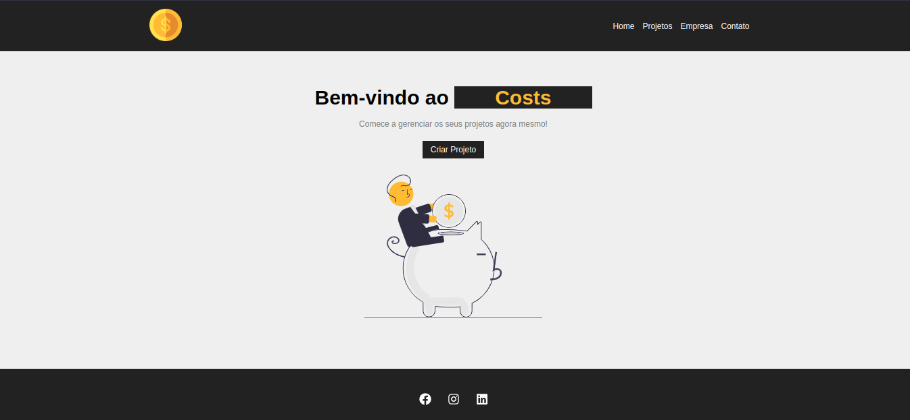

<h1 align="center">
    
</h1>

<h2 align="center">Costs</h2>
<p> 
  O <strong>Costs</strong> é uma plataforma para gerenciamento de custos de projetos de tecnologia (POC) desenvolvida durante o curso para aprendizado de <strong>React</strong> do <strong>Matheus Battisti<strong>.
</p>

[_Link do Curso no youtube_](https://www.youtube.com/watch?v=FXqX7oof0I4&list=PLnDvRpP8BneyVA0SZ2okm-QBojomniQVO)

## :dart: Índice

- [Status](##status)
- [Tecnologias](#tecnologias)
- [Pré-Requisitos](#pre-requisitos)
- [Executando o projeto](#executando-o-projeto)
- [Licença](#licença)

## :game_die: Status

<p align="center">
  
  
  
  
</p>

## :toolbox: Tecnologias

- [react](https://reactjs.org/)
- [uuid](https://www.npmjs.com/package/uuid)
- [json-server](https://www.npmjs.com/package/json-server)

## :heavy_check_mark: Pré-requisitos

Antes de iniciar, certifique-se que tenha instalado em seu computador as seguintes ferramentas:

- [Node.js](https://nodejs.org/)
- [Visual Studio Code](https://visualstudio.microsoft.com/pt-br/)

## :gear: Executando o projeto

1. _Faça o clone do repositório:_

```sh
$ git clone https://github.com/Juliocsilvestre/crud-react-api
```

2. _Instale as depêndencias do projeto:_

```sh
# Acesse o diretório do projeto:
$ cd costs

# Instale as dependências:
$ npm install
```

3. _Execute a aplicação:_

```sh
$ npm start
```

4. _Em seguida abra um segundo terminal, para executarmos o banco de dados (json-server):_

```sh
# OBS: Não se esqueça de estar na raiz do projeto, da mesma forma que no primeiro terminal.
$ npm run backend
```

Pronto! Caso o navegador não abra automaticamente, a aplicação estará rodando em: `localhost:3000`

## :bookmark_tabs: Licença

Este projeto está licenciado nos termos da licença MIT. Veja o arquivo [LICENSE](./LICENSE) para mais detalhes.

## :jigsaw: Contato

- :mailbox_with_mail: E-mail: <a href="mailto:jcss.silvestre@gmail.com">jcss.silvestre@gmail.com</a>
- :pushpin: Linkedin: [in/juliocsilvestre](https://www.linkedin.com/in/juliocsilvestre/)

<sup>Desenvolvido por <i><strong>Julio Silvestre.</i></strong></sup>
